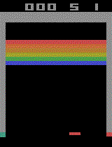

# Atari Breakout (Summer 2022 Project)

This is an Atari Breakout environment in OpenAI gym. I completed this project as part of my introduction to Reinforcement Learning. I implemented it with the help of Stable Baselines3 which is a set of reliable implementations of reinforcement learning algorithms in PyTorch. The algorithm used to complete this environement is Advantage Actor Critic (A2C).

## How does it work

You move a paddle and hit the ball in a brick wall at the top of the screen. Your goal is to destroy the brick wall. You can try to break through the wall and let the ball wreak havoc on the other side, all on its own! You have five lives.

See below a demo of the environment

## Reference

* [Reinforcement Learning in 3 Hours Course by Nicholas Renotte](https://www.youtube.com/watch?v=Mut_u40Sqz4&t=4596s&ab_channel=NicholasRenotte)
 * [OpenAI Box2D Car Racing Environment](https://www.gymlibrary.dev/environments/atari/breakout/)
* [Stable Baselines3](https://stable-baselines3.readthedocs.io/en/master/)